# DevSecOps Secrets Lab

Hands-on DevSecOps laboratory focused on secure secret management using GitHub Actions, Docker and environment variables.


---

## About

By integrating GitHub Actions, Docker, environment variables and Python, the laboratory demonstrates a secure DevSecOps workflow aligned with industry best practices.

The lab shows how sensitive information can be securely stored using GitHub Secrets and injected into an application during workflow execution without exposing credentials in the source code.

The project demonstrates how GitHub Actions, Docker, environment variables, and Python can be integrated to build a secure DevSecOps workflow aligned with industry best practices.


## Project Overview

Modern applications rely on sensitive information such as API keys, passwords, and access tokens. Storing these values directly in source code creates significant security risks.

This laboratory demonstrates a secure approach to managing secrets by combining GitHub Secrets, GitHub Actions, Docker, and environment variables. During the workflow execution, sensitive data is securely injected into the application without being exposed in the repository, following common DevSecOps practices used in CI/CD pipelines.

## Contents

- [About](#about)
- [Project Overview](#project-overview)
- [Objectives](#objectives)
- [Key Features](#key-features)
- [Architecture](#architecture)
- [Technologies](#technologies)
- [Project Structure](#project-structure)
- [Pipeline Workflow](#pipeline-workflow)
- [Security Practices](#security-practices)
- [Project Execution](#project-execution)
- [Evidence](#evidence)
- [Technical Documentation](#technical-documentation)
- [Lessons Learned](#lessons-learned)
- [Author](#author)
- [License](#license)

## Objectives

- Understand secure secret management in DevSecOps pipelines.
- Configure GitHub Secrets.
- Consume secrets through environment variables.
- Prevent sensitive information from being committed to the repository.
- Execute an automated GitHub Actions workflow.
- Demonstrate secure development practices.


## Key Features

- Secure management of secrets using GitHub Secrets.
- Automated CI/CD pipeline with GitHub Actions.
- Environment variable injection during workflow execution.
- Docker containerization for application execution.
- Secure repository configuration using `.gitignore` and `.dockerignore`.
- Practical implementation of DevSecOps security concepts.


## Architecture

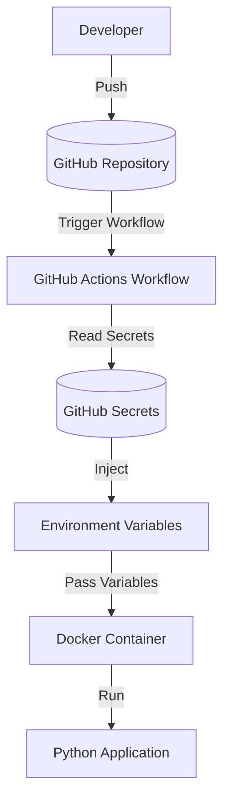

The workflow starts when a developer pushes changes to the repository. GitHub Actions automatically executes the pipeline, securely injects repository secrets as environment variables, and runs the Python application without exposing sensitive information.

---

## Technologies

| Category | Technologies |
|----------|--------------|
| CI/CD | GitHub Actions |
| Containerization | Docker |
| Language | Python |
| Version Control | Git & GitHub |
| Security | GitHub Secrets |
| Configuration | Environment Variables |


## Project Structure

This structure separates the application source code, CI/CD workflow, and configuration files, making the project easier to understand and maintain.

```text
devsecops-secrets-lab/
│
├── .github/
│   └── workflows/
│       └── pipeline.yml
│
├── app/
│   └── main.py
│
├── docs/
│   ├── images/
│   └── reports/
│       └── DevSecOps_Secrets_Lab_Report.pdf
│
├── .dockerignore
├── .env.example
├── .gitignore
├── Dockerfile
└── README.md
```

---

## Pipeline Workflow

The GitHub Actions workflow automates the execution of the laboratory whenever changes are pushed to the repository.

Pipeline stages:

1. The developer pushes new code to GitHub.
2. GitHub Actions starts the workflow.
3. Repository Secrets are securely injected as environment variables.
4. The Python application executes using the injected variables.
5. The workflow validates that secrets are consumed without exposing sensitive information.


## Security Practices

This laboratory follows security best practices for handling sensitive information:

- Secrets are stored using GitHub Secrets.
- No credentials are committed to the repository.
- A `.env.example` file documents required variables without exposing real values.
- `.gitignore` prevents sensitive files from being versioned.
- `.dockerignore` excludes unnecessary files from Docker images.
- Environment variables are injected securely during workflow execution.


## Project Execution

### Prerequisites

- Git
- Docker
- Python 3.x
- GitHub Account

### Clone the Repository

```bash
git clone https://github.com/SkSamuel157/devsecops-secrets-lab.git
cd devsecops-secrets-lab
```

### Configure Environment Variables

Create a `.env` file based on `.env.example`.

```text
DATABASE_URL=
DATABASE_USER=
DATABASE_PASSWORD=
API_TOKEN=
JWT_SECRET=
```

### Execute

```bash
python app/main.py
```

The application will consume the configured environment variables during execution.

---

## Evidence

### Repository Structure

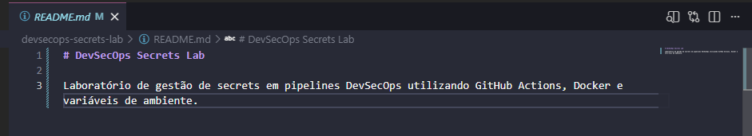

Project organization highlighting the application source code, GitHub Actions workflow, Docker configuration and documentation.

---

### Environment Variables

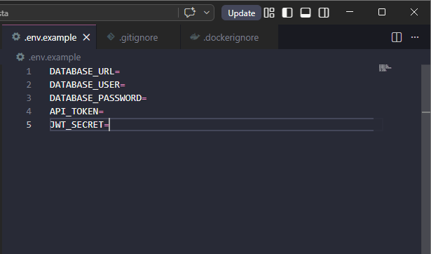

Example of the required environment variables used by the application. The repository provides a `.env.example` file while sensitive values are securely stored as GitHub Secrets.

---

### Git Ignore Configuration

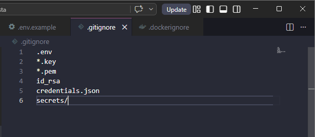

Sensitive files such as credentials, keys and local secret folders are excluded from version control.

---

### Docker Ignore Configuration

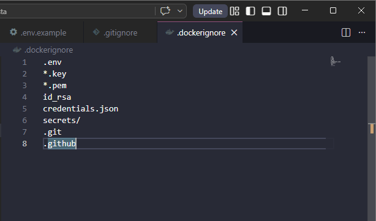

Unnecessary files are excluded from the Docker build context, resulting in smaller and cleaner container images.

---

### Dockerfile

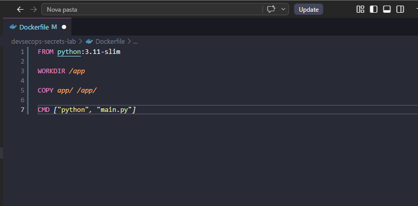

Docker configuration used to build a lightweight Python container responsible for executing the application.

---

### GitHub Actions Workflow

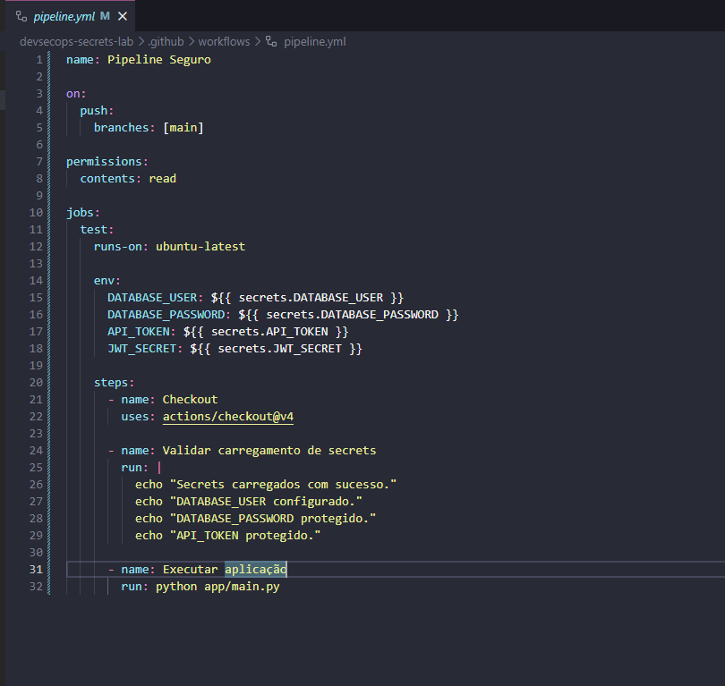

Workflow definition responsible for loading repository secrets and executing the application automatically after each push.

---

### GitHub Repository Secrets

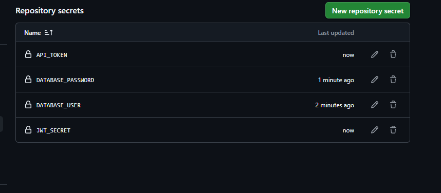

Sensitive credentials are securely stored using GitHub Repository Secrets instead of being committed to the source code.

---

### Workflow Execution

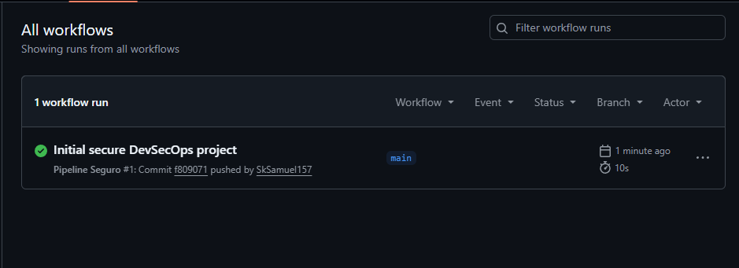

Successful execution of the GitHub Actions workflow after a push to the repository.

---

### Workflow Logs

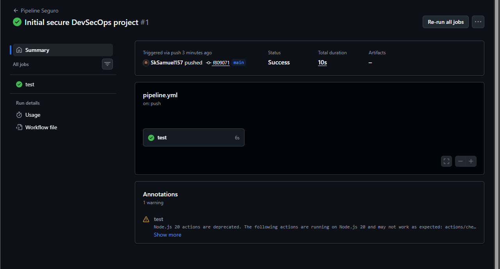

Pipeline logs showing that secrets were successfully loaded while their values remained protected.

---

### Python Application Execution

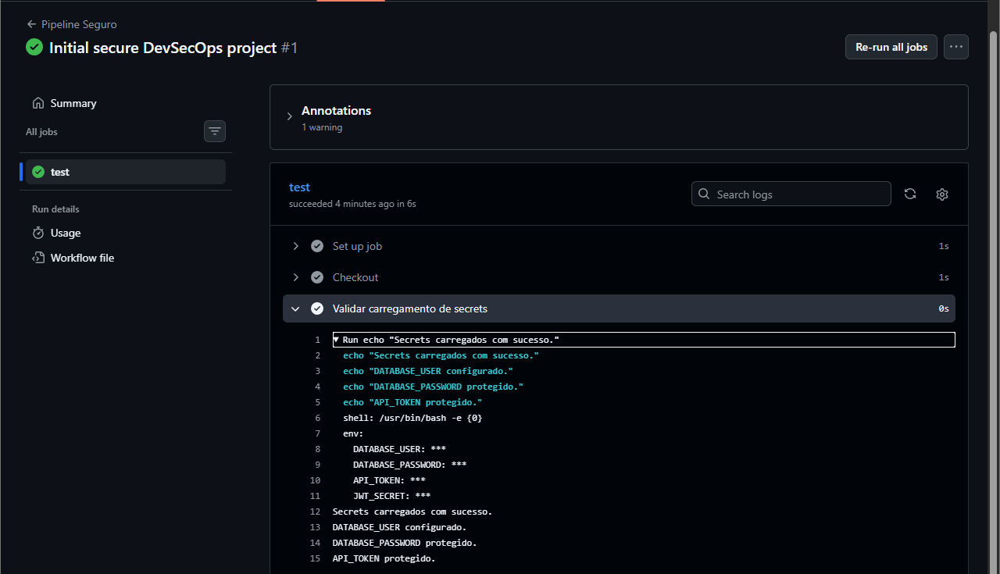

Application execution validating that environment variables are correctly injected without exposing sensitive information.

---

### Docker Image Build

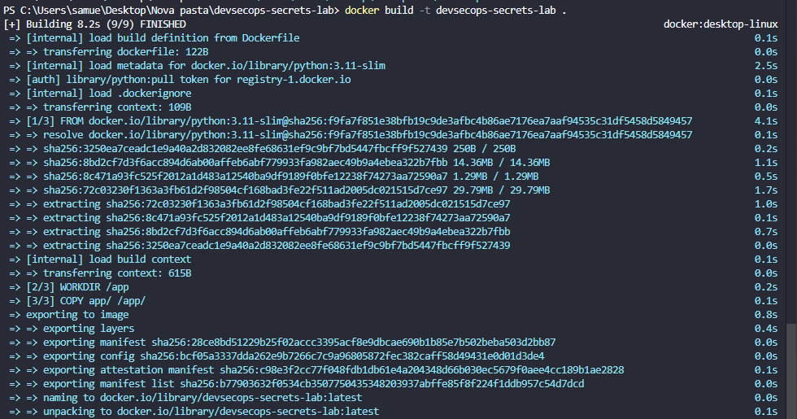

Successful Docker image build using the provided Dockerfile.

---

### Docker Container Execution

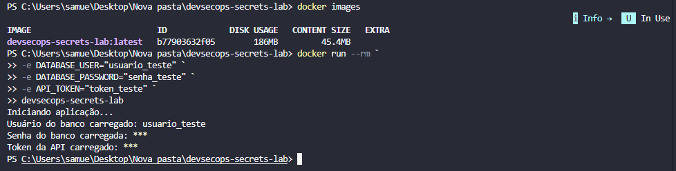

Container execution demonstrating that the application correctly consumes environment variables passed at runtime.

## Technical Documentation

The complete technical documentation is available in the report below. It describes the project architecture, implementation process, workflow execution, Docker configuration, GitHub Actions pipeline, and security practices adopted throughout the laboratory.

- [Technical Report (PDF)](...)

## Lessons Learned

This laboratory reinforced several practical DevSecOps concepts, including:

- Secure secret management.
- CI/CD automation with GitHub Actions.
- Docker containerization.
- Secure environment variable handling.
- Repository hardening using `.gitignore` and `.dockerignore`.
- Practical implementation of secure development workflows.
- Documentation and reproducible laboratory design.

## Author

**Samuel Castro**

Cybersecurity Student specializing in Blue Team, DevSecOps and Infrastructure Security.

- GitHub: https://github.com/SkSamuel157
- LinkedIn: https://linkedin.com/in/samuelscs


## License

This project is available for educational and portfolio purposes.

The source code may be used as a reference for learning secure DevSecOps concepts, provided proper attribution is maintained.
