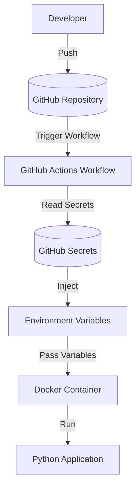

# DevSecOps Secrets Lab
> Hands-on DevSecOps laboratory focused on secure secret management using GitHub Actions, Docker, and environment variables.


## About

This project was developed as a hands-on DevSecOps laboratory to demonstrate secure secret management practices in CI/CD pipelines.

The lab shows how sensitive information can be securely stored using GitHub Secrets and injected into an application during workflow execution without exposing credentials in the source code.

The project demonstrates how GitHub Actions, Docker, environment variables, and Python can be integrated to build a secure DevSecOps workflow aligned with industry best practices.


## Project Overview

Modern applications rely on sensitive information such as API keys, passwords, and access tokens. Storing these values directly in source code creates significant security risks.

This laboratory demonstrates a secure approach to managing secrets by combining GitHub Secrets, GitHub Actions, Docker, and environment variables. During the workflow execution, sensitive data is securely injected into the application without being exposed in the repository, following common DevSecOps practices used in CI/CD pipelines.


## Objectives

- Understand secure secret management in DevSecOps pipelines.
- Configure GitHub Secrets.
- Consume secrets through environment variables.
- Prevent sensitive information from being committed to the repository.
- Execute an automated GitHub Actions workflow.
- Demonstrate secure development practices.


## Key Features

- Secure management of secrets using GitHub Secrets.
- Automated CI/CD pipeline with GitHub Actions.
- Environment variable injection during workflow execution.
- Docker containerization for application execution.
- Secure repository configuration using `.gitignore` and `.dockerignore`.
- Practical implementation of DevSecOps security concepts.


## Architecture



The workflow starts when a developer pushes changes to the repository. GitHub Actions automatically executes the pipeline, securely injects repository secrets as environment variables, and runs the Python application without exposing sensitive information.

---

## Technologies

| Category | Technologies |
|----------|--------------|
| CI/CD | GitHub Actions |
| Containerization | Docker |
| Language | Python |
| Version Control | Git & GitHub |
| Security | GitHub Secrets |
| Configuration | Environment Variables |


## Project Structure

This structure separates the application source code, CI/CD workflow, and configuration files, making the project easier to understand and maintain.

```text
devsecops-secrets-lab/
│
├── .github/
│   └── workflows/
│       └── pipeline.yml
│
├── app/
│   └── main.py
│
docs/
├── images/
│
├── reports/
│  └── DevSecOps_Secrets_Lab_Report.pdf
│
├── .dockerignore
├── .env.example
├── .gitignore
├── Dockerfile
└── README.md
```

---

## Pipeline Workflow

The GitHub Actions workflow automates the execution of the laboratory whenever changes are pushed to the repository.

Pipeline stages:

1. The developer pushes new code to GitHub.
2. GitHub Actions starts the workflow.
3. Repository Secrets are securely injected as environment variables.
4. The Python application executes using the injected variables.
5. The workflow validates that secrets are consumed without exposing sensitive information.


## Security Practices

This laboratory follows security best practices for handling sensitive information:

- Secrets are stored using GitHub Secrets.
- No credentials are committed to the repository.
- A `.env.example` file documents required variables without exposing real values.
- `.gitignore` prevents sensitive files from being versioned.
- `.dockerignore` excludes unnecessary files from Docker images.
- Environment variables are injected securely during workflow execution.


## Project Execution

### Prerequisites

- Git
- Docker
- Python 3.x
- GitHub Account

### Clone the Repository

```bash
git clone https://github.com/SkSamuel157/devsecops-secrets-lab.git
cd devsecops-secrets-lab
```

### Configure Environment Variables

Create a `.env` file based on `.env.example`.

```text
DATABASE_URL=
DATABASE_USER=
DATABASE_PASSWORD=
API_TOKEN=
JWT_SECRET=
```

### Execute

```bash
python app/main.py
```

The application will consume the configured environment variables during execution.

---

## Evidence

### GitHub Actions Workflow


The workflow executes automatically after every push and securely injects repository secrets during the pipeline.

---

### Repository Secrets


Sensitive information is stored using GitHub Secrets instead of hardcoded credentials.

---

### Pipeline Logs


The workflow validates that secrets are available without exposing their values.

---

### Docker Build


Docker successfully builds the application image.

---

### Docker Execution


The container consumes environment variables securely during runtime.

## Technical Documentation

A complete technical report describing the laboratory, implementation details, workflow, architecture and security practices is available below.

- [Technical Report (PDF)](docs/reports/DevSecOps_Secrets_Lab_Report.pdf)

## Lessons Learned

During this laboratory, the following concepts were practiced:

- Secure secret management.
- GitHub Actions workflow automation.
- Docker integration.
- Environment variable handling.
- CI/CD pipeline fundamentals.
- DevSecOps security best practices.
- Docker containerization basics.
- Secure CI/CD pipeline design.

## Author

Samuel Castro

Cybersecurity Student specializing in Blue Team, DevSecOps and Infrastructure Security.

- GitHub: https://github.com/SkSamuel157
- LinkedIn: https://linkedin.com/in/samuelscs


## License

This project was developed for educational purposes and portfolio demonstration.
